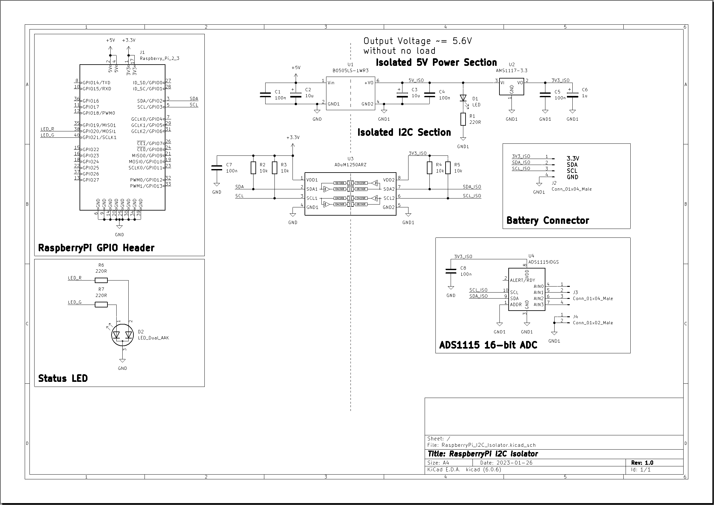
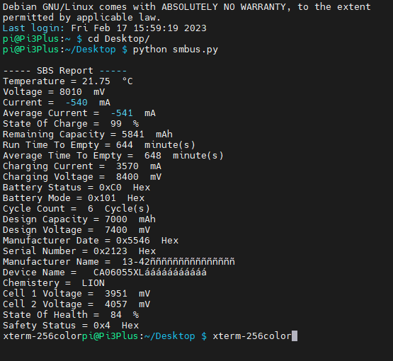

# Interfacing-Laptop-Battery-With-RaspberryPi
Interfacing the laptop battery with the RaspberryPi

<p align="center">
  
</p>

# Project TODO List
|#|Task|Completed ?|Comments|
|---|---|---|---|
|1|Designing Schematics|<b><span style="color: green">&check;</span></b>| |
|2|Designing POC|<b><span style="color: green">&check;</span></b>| |
|3|Designing POC PCB|<b><span style="color: red">&check;</span></b>| |
|3|Testing the code/POC hardware before push|<b><span style="color: green">&check;</span></b> |
|4|Push the repo to the public|<b><span style="color: green">&check;</span></b> |
|5|Documenting my work on GitHub|<b><span style="color: green">&check;</span></b>|
|6|Integrating BQ24725 Smart Charger|<b><span style="color: red">✗</span></b>|

# Introduction
Hi, in this repository, I will talk about how I interfaced the laptop batteries with the Raspberry Pi. This is the biggest part of my next project (making advanced UPS for Raspberry Pi). In this part I will talk about reading the battery information with the raspberryPi.

# Disclaimer
Warning: Laptop batteries are so dangerous because they contain high energy and could explode if you make any mistake with them. It could even damage any device that is connected to it. I am not responsible for any damage or injuries that occur to anyone. Don't try this at home. You are doing this at your own risk.

# Safety First!!
When working with lithium batteries, you must keep them in a clean environment (keep the batteries away from any metal objects). Keep the batteries in well-protected boxes; keep them far from any liquids; use proper safety tools for handling and containing lithium fires; keep the batteries far from children; and use proper tools for protecting your own computer, such as:

1. Using an I2C isolator to isolate the Raspberry Pi from the lithium battery that is connected to it; if the high-voltage wires come into contact with any GPIO, the Raspberry Pi and everything connected to it will be fried. I will talk about this part more later. You can connect the battery directly to the GPIOs, but this is too dangerous; you are doing this at your own risk.

2. Make sure to fasten all your wires and keeping them intact.

3. Keep the communication wires away from the high-voltage wires.

# Getting Started
A while ago, I  started tinkering with laptop batteries through the following repositories. Have a look at them to get an idea of the work history:
* [TIVAC_TM4C123G_SMBUS_BMS_INTERFACING
](https://github.com/omarKmekkawy/TIVAC_TM4C123G_SMBUS_BMS_INTERFACING).
* [Reverse Engineering BQ20z70 Laptop BMS](https://github.com/omarKmekkawy/Reverse_Engineering_BQ20z70_Laptop_BMS).

After that, I tried to interface the laptop battery with the Raspberry Pi; somehow I succeeded in the prototyping process.

# Hardware Design
I made a small prototype for an isolated I2C interface for the raspberry pi in order to protect the pi from burning (unfortunately, I don't have many raspberry pi boards to sacrifice). Here is an image for the

The design is made using Kicad 6.0:

<p align="center">
  
</p>

You can find the schematic in this folder [RaspberryPi_I2C_Isolator-backups](./Hardware/RaspberryPi_I2C_Isolator)

In the previous image, we have multiple section blocks as follows:
* RaspberryPi GPIO Header: This block contains the Raspberry Pi connector, which is used to connect the hardware to the Raspberry Pi.

* Status LED: I have added an optional bi-color LED with both green and red colors to indicate the status of the battery. It's reserved for future use.

* Isolated I2C Section: This section contains I2C isolation for both data and power to the battery. This section is necessary for the Raspberry Pi's protection against high voltage. You can omit this section and connect the battery directly, but you will be responsible for any consequences. I don't want to burn my Raspberry Pi.

* ADS1115 16-bit ADC: I have added this section to be used in battery automation tasks (reserved for future use).

* Battery connector: This section contains a 4-pin battery connector that is used for communication.

# Bill Of Material (BOM)
Here, I give you the BOM of my design. I got most of the parts from AliExpress because buying from Mouser and Digikey would cost me a lot here in Egypt.

| # | Part Name  | Quantities | Links |
| ------------- | ------------- | ------------- | ------------- |
| 1 | DIY Proto HAT Shield for Raspberry Pi 3 and Raspberry Pi 2 Model B / B+ / A+ ( Red) | 1 | [1](https://www.aliexpress.com/item/32340467652.html?spm=a2g0o.order_list.order_list_main.68.583c1802ZRF1yf) - [2](https://www.aliexpress.com/item/1005003412631036.html?spm=a2g0o.order_list.order_list_main.39.3a981802FBjcj6) |
| 1 | 10PCS ADUM1250ARZ SOP8 ADUM1250AR SOP ADUM1250 SMD 1250ARZ SOP-8 | 1 | [Aliexpress](https://www.aliexpress.com/item/1005002035874500.html?spm=a2g0o.order_list.order_list_main.78.583c1802ZRF1yf) |

# Proof Of Concept (POC)
I have built POC based on the previous schematic, here are some close photos:

<p align="center">
  
</p>

<p align="center">
  
</p>

# The Code

I am not a great Python coder. I have written this code for testing purposes only, maybe someone else could help me improve this mess.

```python
import time
import ctypes
from turtle import delay
from smbus2 import SMBus
import numpy

i2c_address = 0x0B
i2c_ch = 1

delay = 0.01

reg_BatteryMode = 0x03
reg_Temperature = 0x08
reg_voltage = 0x09
reg_current = 0x0A
reg_AverageCurrent = 0x0B
reg_RelativeStateOfCharge = 0x0D
reg_RemainingCapacity = 0x0F
reg_RunTimeToEmpty = 0x11
reg_AverageTimeToEmpty = 0x12
reg_ChargingCurrent = 0x14
reg_ChargingVoltage = 0x15
reg_BatteryStatus = 0x16
reg_CycleCount = 0x17
reg_DesignCapacity = 0x18
reg_DesignVoltage = 0x19

reg_ManufacturerDate = 0x1B
reg_SerialNumber = 0x1C
reg_ManufacturerName = 0x20
reg_DeviceName = 0x21
reg_DeviceChemistry = 0x22

reg_CellVoltage4 = 0x3C
reg_CellVoltage3 = 0x3D
reg_CellVoltage2 = 0x3E
reg_CellVoltage1 = 0x3F
reg_StateOfHealth = 0x4F
reg_SafetyStatus = 0x51

bus = SMBus(i2c_ch)
time.sleep(delay)
battery_mode = bus.read_word_data(i2c_address, reg_BatteryMode)
time.sleep(delay)
temperature = bus.read_word_data(i2c_address, reg_Temperature)
time.sleep(delay)
voltage = bus.read_word_data(i2c_address, reg_voltage)
time.sleep(delay)
current = numpy.short(bus.read_word_data(i2c_address, reg_current))
time.sleep(delay)
average_current = numpy.short(bus.read_word_data(i2c_address, reg_AverageCurrent))
time.sleep(delay)
relative_state_of_charge =  bus.read_word_data(i2c_address, reg_RelativeStateOfCharge)
time.sleep(delay)
remaining_capacity = bus.read_word_data(i2c_address, reg_RemainingCapacity)
time.sleep(delay)
run_time_to_empty = bus.read_word_data(i2c_address, reg_RunTimeToEmpty)
time.sleep(delay)
average_time_to_empty = bus.read_word_data(i2c_address, reg_AverageTimeToEmpty)
time.sleep(delay)
charging_current = bus.read_word_data(i2c_address, reg_ChargingCurrent)
time.sleep(delay)
charging_voltage = bus.read_word_data(i2c_address, reg_ChargingVoltage)
time.sleep(delay)
battery_status = bus.read_word_data(i2c_address, reg_BatteryStatus)
time.sleep(delay)
cycle_vount = bus.read_word_data(i2c_address, reg_CycleCount)
time.sleep(delay)
design_capacity = bus.read_word_data(i2c_address, reg_DesignCapacity)
time.sleep(delay)
design_voltage = bus.read_word_data(i2c_address, reg_DesignVoltage)
time.sleep(delay)
manufacturer_date = bus.read_word_data(i2c_address, reg_ManufacturerDate)
time.sleep(delay)
serial_number = bus.read_word_data(i2c_address, reg_SerialNumber)
time.sleep(delay)
manufacturer_name = bus.read_i2c_block_data(i2c_address, reg_ManufacturerName, 21)
time.sleep(delay)
device_name = bus.read_i2c_block_data(i2c_address, reg_DeviceName, 21)
time.sleep(delay)
device_chemistry = bus.read_i2c_block_data(i2c_address, reg_DeviceChemistry, 5)
time.sleep(delay)
cell_voltage2 = bus.read_word_data(i2c_address, reg_CellVoltage2)
time.sleep(delay)
cell_voltage1 = bus.read_word_data(i2c_address, reg_CellVoltage1)
time.sleep(delay)
state_of_health = bus.read_word_data(i2c_address, reg_StateOfHealth)
time.sleep(delay)
safety_status = bus.read_word_data(i2c_address, reg_SafetyStatus)

bus.close()
time.sleep(0.1)
print("\n----- SBS Report -----")
print("Temperature = {:.2f}".format(float(temperature/ 10 - 273.15)), " °C")
print("Voltage =",voltage, " mV")
print("Current = ", current, " mA")
print("Average Current = ", average_current, " mA")
print("State Of Charge = ", relative_state_of_charge , " %")
print("Remaining Capacity =",remaining_capacity, " mAh")
print("Run Time To Empty =",run_time_to_empty, " minute(s)")
print("Average Time To Empty = ", average_time_to_empty, " minute(s)")
print("Charging Current = ", charging_current , " mA")
print("Charging Voltage = ", charging_voltage , " mV")
print("Battery Status = 0x{:X}".format(battery_status) , " Hex")
print("Battery Mode = 0x{:X}".format(battery_mode) , " Hex")
print("Cycle Count = ", cycle_vount , " Cycle(s)")
print("Design Capacity =",design_capacity, " mAh")
print("Design Voltage = ", design_voltage , " mV")
print("Manufacturer Date = 0x{:X}".format(manufacturer_date) , " Hex")
print("Serial Number = 0x{:X}".format(serial_number) , " Hex")
print("Manufacturer Name = ", "".join([chr(c) for c in manufacturer_name]))
print("Device Name = ", "".join([chr(c) for c in device_name]))
print("Chemistery = ", "".join([chr(c) for c in device_chemistry]))
print("Cell 1 Voltage = ", cell_voltage1 , " mV")
print("Cell 2 Voltage = ", cell_voltage2 , " mV")
print("State Of Health = ", state_of_health , " %")
print("Safety Status = 0x{:X}".format(safety_status) , " Hex")
```

# Battery Connection
I have powered the Raspberry Pi from my new modified battery with the following setup: 2S, 1P. I have connected the battery's SMBus connector to the Raspberry Pi and then used a buck DC-DC converter to step down the voltage to 5V, which powers the Raspberry Pi. In the following section, you will find the data readout from the battery.

# Results
After running the code, this is the data read from the battery.
<p align="center">
  
</p>